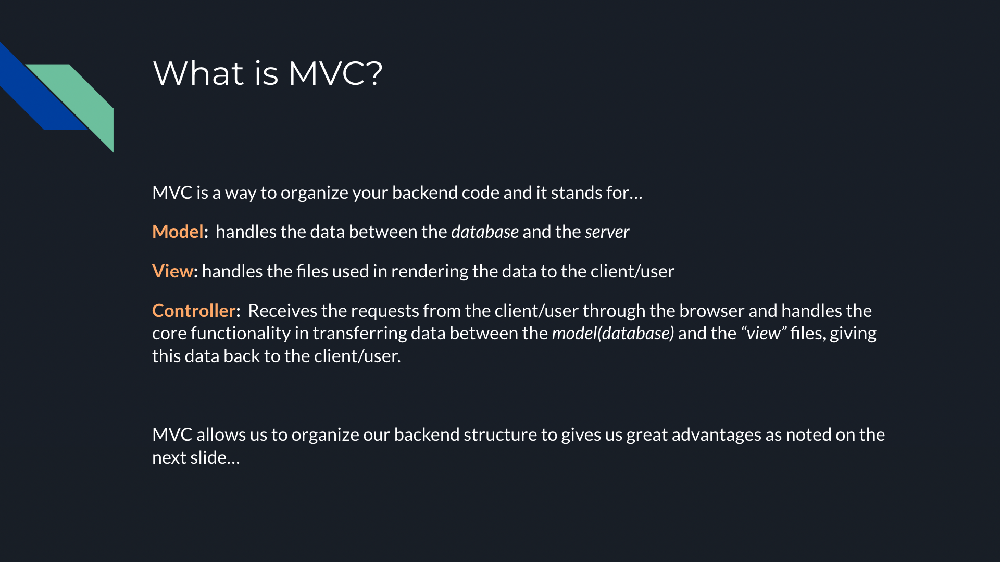

# MVC for JavaScript Web Applications lecture : <a target="_blank" href="https://docs.google.com/presentation/d/1dASUU6bs-H6VFPSvMH_yoLet9PYhFkIyCr_L6TPdV30/edit#slide=id.p">Visit Here</a>

A concise presentation about MVC, an architectural paradigm for backend programming. This was done for the benefit of the development team at 100devs and to introduce more organization to our software.

### Opening slide

### What is MVC?

### Reasons to use MVC

### Model

### View

### Controller

### Diagram for simple MVC

### Thank you with references

## Tech used: 

## Optimizations

To improve this on presentation I would implement interactivity like pop-ups, animations, drag and drops, to retain focus and make the learning more enjoyable to work through. I would also add other architectural patterns in a slide as examples and compare them to MVC.

## Lessons Learned:

Solidified my understanding of MVC structure and it's organizational use for backend JS development.

## More Projects

<table bordercolor="#66b2b2">
  
  <tr>
    <td width="33.3%"  style="align:center;" valign="top">
<a target="_blank" href="https://github.com/Cesar-Quintero/Cesar-Quintero-Portfolio-Website">Portfolio Website</a>
         
      
    </td>
    <td width="33.3%" valign="top">
<a target="_blank" href="https://github.com/Cesar-Quintero/Tea-Time">Tea Time</a>
       
        
    </td>
    <td width="33.3%" valign="top">
<a target="_blank" href="https://github.com/Cesar-Quintero/Market_List_App">Market List App</a>
         
      
    </td>
  </tr>
</table>